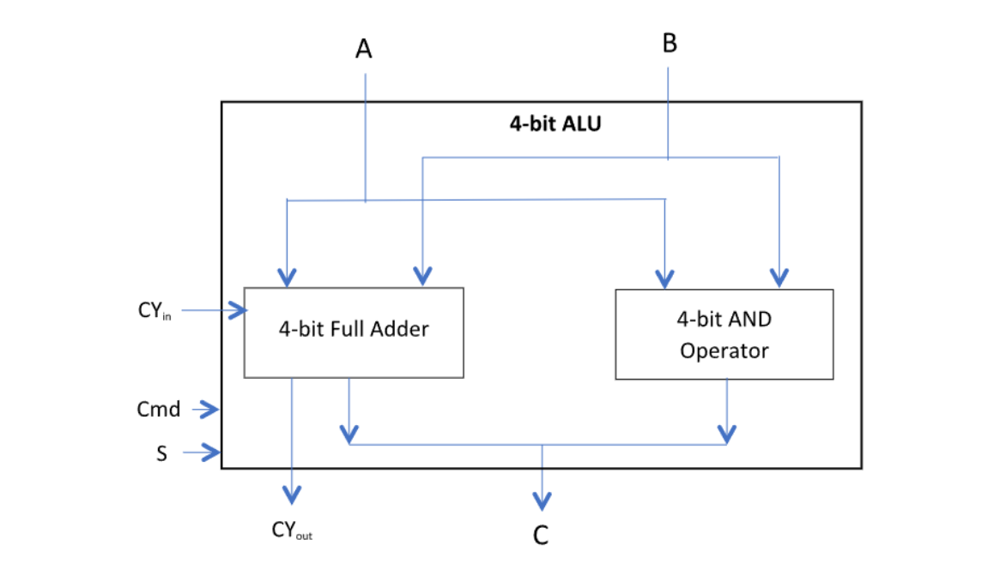

## CO Lab Assignment-1

### Objectives:
To gain an understanding of the functioning of an ALU inside a processor by fabricating it in a logic simulator environment and experimenting with it.

### Exercises:
Fabricate a simple 4-bit ALU capable of performing the two operations: arithmetic addition and logical AND as shown in the diagram below in a logic simulator environment.  
Apply all combinations of inputs and the commands as indicated in the table below and record the observed corresponding outputs.  

### Details of work:
(include screenshots of the circuit diagram that you designed on the simulator and describe the details in your own words.)

### Observation Table:
| A  | B  | CYin | Cmd | S  | C  | CYout | Remarks |
|----|----|------|-----|----|----|-------|---------|
| 5  | 7  | 0    | 0   | 0  |    |       |         |
| 5  | 7  | 0    | 0   | 1  |    |       |         |
| 5  | 7  | 0    | 1   | 0  |    |       |         |
| 5  | 7  | 0    | 1   | 1  |    |       |         |
| 5  | 7  | 1    | 0   | 0  |    |       |         |
| 5  | 7  | 1    | 0   | 1  |    |       |         |
| 5  | 7  | 1    | 1   | 0  |    |       |         |
| 5  | 7  | 1    | 1   | 1  |    |       |         |
| 10 | 5  | 0    | 0   | 1  |    |       |         |
| 10 | 5  | 1    | 0   | 1  |    |       |         |
| 10 | 5  | 0    | 1   | 1  |    |       |         |
| 10 | 5  | 0    | 0   | 1  |    |       |         |
| 15 | 0  | 0    | 1   | 0  |    |       |         |
| 0  | 15 | 0    | 1   | 1  |    |       |         |
| 14 | 7  | 0    | 0   | 1  |    |       |         |
| 14 | 7  | 1    | 0   | 1  |    |       |         |
| 8  | 2  | 1    | 0   | 1  |    |       |         |
| 15 | 15 | 0    | 0   | 1  |    |       |         |
| 15 | 15 | 0    | 1   | 1  |    |       |         |
| 15 | 15 | 1    | 0   | 1  |    |       |         |
| 15 | 15 | 1    | 1   | 1  |    |       |         |

### Learnings:
(write in your own words what you have learned from the experiment)

