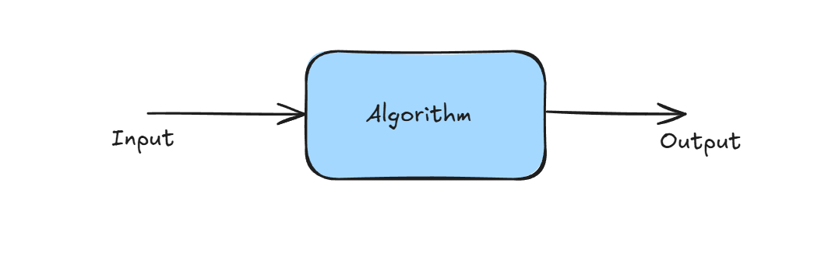
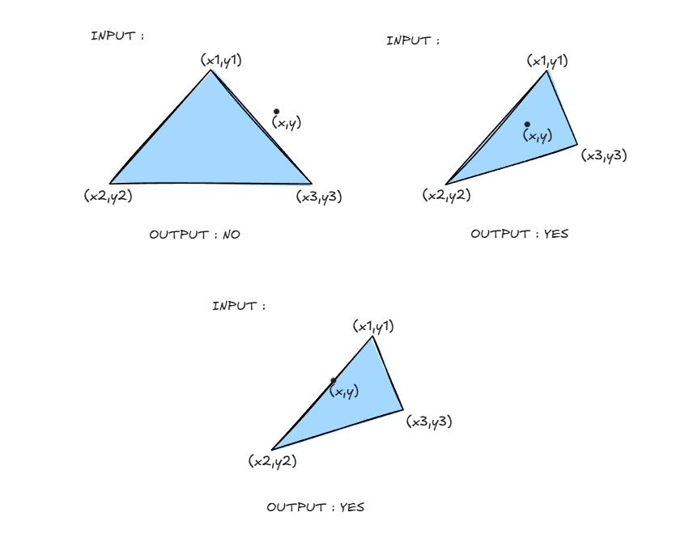
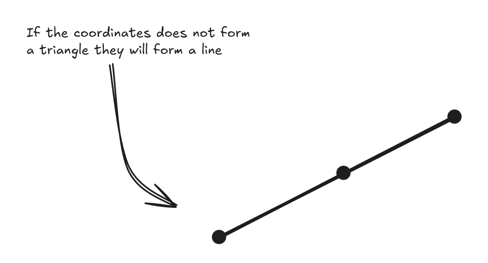
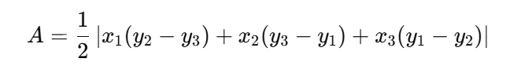
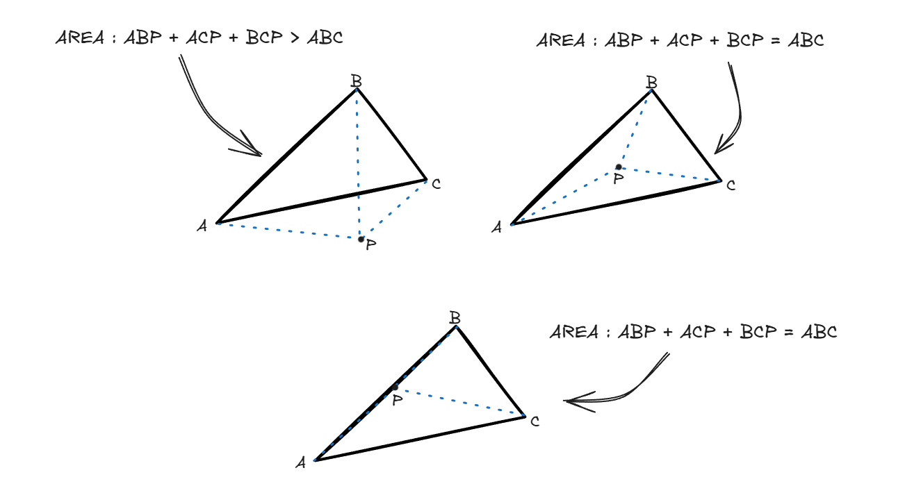
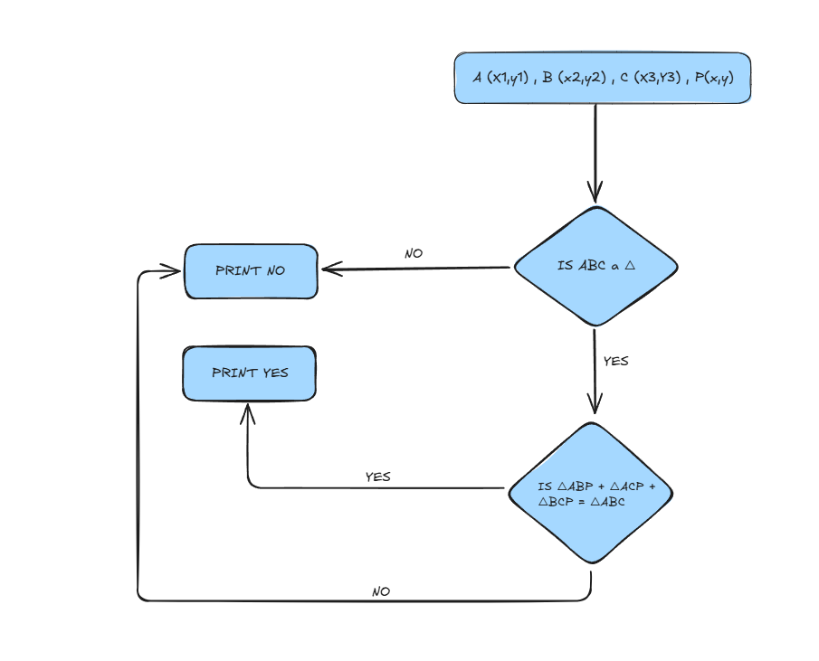

## Basics of Algorithms

#### **Algorithm :** 
Specification of a sequence of valid steps which after a finite time convert valid **Input** to valid **Output**



---

We try to solve various **problems** using Algorithms ,Let's look at an example 

### **The problem:** Given a Triangle △ and a point P in 2D, output "YES" if P ∈ △ otherwise "NO" 

**Input** <br>
Four points:  
- Three vertices of the triangle: **(x₁, y₁), (x₂, y₂), (x₃, y₃)**  
- One point P: **(x, y)**   
- `(x₁, y₁, x₂, y₂, x₃, y₃, x, y) ∈ Real Numbers` (float or integer).  

**Output**  
Print `"YES"` if `P ∈ △`, otherwise print `"NO"`.




### **Solution:** 
Let's think how we can solve the problem:

- **Step 1 :** Find if the given Coordinates form a Triangle or Not, How ??



How do we determine if three points lie in a straight line ? :
- We can find the Area of the triangle if its 0 , they form a Straight line


- **Step 2 :** Find if the Point lies inside the triangle or not, How ?? <br>
    - The Point P makes three Triangles with the three vertices of the Triangle , If the Sum of these three triangles if more than the area of triangle The point lies outside the triangle otherwise it lies inside
    - If `Area( △ABP + △ACP + △BCP > △ABC)` PRINT `NO` else PRINT `YES`



- **Flowchart :** 



- **CODE :**

```cpp

double areaOfTriangle(double, double, double, double, double, double);

void pointLiesInsideTriangle(double x1, double y1, double x2 , double y2, double x3, double y3 , double x , double y){
    double areaOfABC = areaOfTriangle(x1,y1,x2,y2,x3,y3);

    if(areaOfABC == 0) cout << "NO"; return; // NOT A TRIANGLE

    double area1 = areaOfTriangle(x1, y1, x, y, x3, y3);
    double area2 = areaOfTriangle(x1, y1, x2, y2, x, y);
    double area3 = areaOfTriangle(x, y, x2, y2, x3, y3);

    if ((area1 + area2 + area3) == areaOfABC){
        cout << "YES";
    }else{
        cout << "NO";
    }
}

double areaOfTriangle(double x1, double y1, double x2 , double y2, double x3, double y3){
    return 0.5 * abs(x1 * (y2 - y3) + x2 * (y3 - y1) + x3 * (y1 - y2));
}
```


> **📝 Note:**  
> There may be other Steps[Algorithm] to solve this problem  
> An problem can be solved using various algorithms , We will look how can we determine which algorithm is good or which is bad
